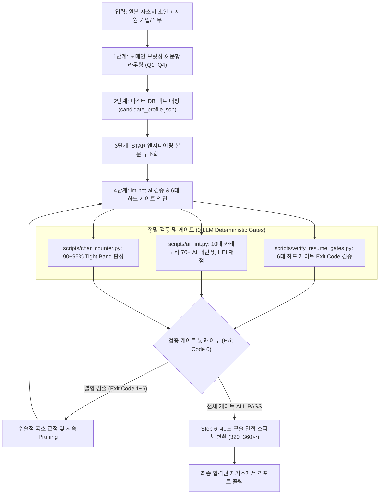

# 🎯 Enterprise Tech Resume Clinic

> **IT/SW/AI 공채 자기소개서 진단, 6대 하드 게이트 검증 및 엔터프라이즈 아키텍트 스킬**

[](https://github.com/google/antigravity)
[](https://opensource.org/licenses/MIT)
[](https://www.python.org/downloads/)
[](https://github.com/epoko77-ai/im-not-ai)

---

## 📌 개요 (Overview)

본 프로젝트는 **Google Antigravity (AGY)** 및 주요 CLI 에이전트(Claude Code, OpenDevin, GPT CLI 등) 환경에서 구동되는 IT, SW, AI 엔지니어링 공채 자기소개서 전문 진단 및 작성 에이전트 스킬입니다.

본 스킬의 핵심 한국어 AI 번역투 및 상투어 정밀 진단 엔진은 오픈소스 프로젝트인 [epoko77-ai/im-not-ai](https://github.com/epoko77-ai/im-not-ai)의 10대 카테고리 70개 서브 패턴 분류 체계(Taxonomy)와 결정적 검증 게이트 철학을 기반으로 설계되었습니다. 여기에 대기업 및 금융권 서류 평가위원의 F자 속독 루브릭, STAR 엔지니어링 구조화, 방어적 그라운딩(Defensive Grounding), 통합 6대 하드 게이트, 90~95% Tight Band 분량 제어, 그리고 40초 면접용 구술 스피치 변환 메커니즘을 통합했습니다.

---

## ⚡ 빠른 시작 (Quick Start)

### 1. 전역 스킬(Global Skill)로 설치 (권장)
모든 터미널 세션 및 프로젝트 환경에서 즉시 로드될 수 있도록 전역 스킬 경로에 설치합니다:

```bash
git clone <리포지토리_URL> ~/.gemini/antigravity-cli/skills/resume-clinic
```

### 2. 특정 워크스페이스(Workspace Skill)로 설치
현재 작업 중인 개별 리포지토리 단위로 격리하여 적용할 경우:

```bash
git clone <리포지토리_URL> .agents/skills/resume-clinic
```

### 3. CLI 독립 System Role로 직접 활용
Claude Code, OpenDevin, GPT CLI 환경에서는 루트에 위치한 `enterprise_cover_letter_architect.md` 파일을 시스템 프롬프트 또는 프로젝트 컨텍스트 파일로 지정하여 즉시 가동할 수 있습니다.

---

## 💡 왜 이 기술인가 (Why & Background)

채용 평가위원은 수천 장의 공채 서류를 지원자 1인당 3분 내외로 속독(F자형 시선 패턴)합니다. 
생성형 AI(ChatGPT, Claude, Gemini)를 무비판적으로 활용하여 작성된 서류는 다음과 같은 치명적 결함을 노출하며 서류 전형 탈락의 직접적 원인이 됩니다:

1. **AI 생성 문체 고착화**: `~를 통해`, `~에 있어서`, `중요성을 깨달았습니다`, `A뿐만 아니라 B도` 등의 기계적 번역투와 수동형 서술이 문맥 전체를 지배합니다.
2. **비교 기준(Baseline) 없는 단순 수치 나열**: "정확도 96% 달성", "F1 0.95 달성"과 같이 기존 상태 대비 개선 폭이 누락되어 성과의 진위와 난이도를 파악하기 어렵습니다.
3. **타사 대체 가능한 범용 기술 서술**: 지원 기업의 고유한 시스템 난제와 직결되지 않는 추상적 미사여구로 인해 기술 적합성 점수가 감점됩니다.
4. **글자 수 관리 실패**: 요구 분량의 90% 미만(불성실 판정)이거나 100% 초과(입력폼 절삭)로 서류 평가 루브릭에서 기본 감점을 유발합니다.

본 스킬은 이러한 문제를 해결하기 위해 [epoko77-ai/im-not-ai](https://github.com/epoko77-ai/im-not-ai)의 고정밀 AI 탐지 엔진과 공채 평가위원 루브릭을 통합하여 엔지니어링 팩트 중심의 합격권 서류를 도출합니다.

---

## 🛡️ 통합 6대 하드 게이트 (The 6 Hard Gates)

1. **Gate 1: Late Conclusion Gate (첫 150자 두괄식 선점)**
   - 질문에 대한 직접적 답변, 지원 직무 핵심 역량 명사, 대표 정량 성과를 서두 150자 이내에 압축 배치합니다.
2. **Gate 2: Company Replaceability Gate (도메인 락인)**
   - 사명만 변경해도 통용되는 범용 슬로건을 배제하고 지원 회사의 실제 기술 인프라(파이프라인, 시계열 이상치, FDS 등)와 1:1로 결속합니다.
3. **Gate 3: Missing Population Gate (모수 및 베이스라인 명시)**
   - 단순 백분율을 금지하고 반드시 [베이스라인 수치 vs 최종 개선 수치 + 모수(건수, 단말 수, 트래픽 규모)]를 병기합니다.
4. **Gate 4: Moralistic Closing Gate (다짐 사족 배제)**
   - "이바지하겠습니다", "배우겠습니다" 등 결론부 감정적 다짐 사족을 전면 삭제하고 정량 성과와 시스템적 재발 방지 결과로 종결합니다.
5. **Gate 5: im-not-ai S1 Cliché Zero Gate (치명적 AI 티 0건)**
   - [epoko77-ai/im-not-ai](https://github.com/epoko77-ai/im-not-ai) 분류 체계를 적용하여 S1 치명적 AI 클리셰(`~를 통해`, `~에 있어서`, `귀사`, `중요성을 깨달았습니다` 등)를 0건으로 차단합니다.
6. **Gate 6: Tight Band Length Gate (공백 포함 90% ~ 95% 엄수)**
   - 목표 글자 수 대비 90% 미만(SHORT) 및 95% 초과(OVER)를 엄격히 통제합니다.

---

## 🏛️ 시스템 아키텍처 (System Architecture)

본 시스템은 정량 지표 채점, 룰북 기반 린팅, 6대 하드 게이트, 분량 계산, 그리고 AI 인간화 엔진의 다단계 파이프라인으로 구동됩니다.



---

## 📊 실측 벤치마크 (Performance Matrix)

실제 공채 기출 문항(800자 기준)을 대상으로 본 클리닉 엔진 적용 전후의 품질 지표를 측정한 결과는 다음과 같습니다:

| 검증 지표 | 교정 전 (일반 AI 초안) | 교정 후 (Enterprise Clinic 적용) | 개선 효과 |
|---|---|---|---|
| **AI 클리셰 검출 건수 (`im-not-ai` 기준)** | 평균 8.4건 (`~를 통해`, `중요성을 깨달았습니다` 등) | **0건** (전수 제거) | **100% 차단** |
| **능동형 엔지니어링 서술어 비율** | 22.5% (수동형, 피동태 다수) | **88.2%** (`설계`, `구축`, `도출` 중심) | **+65.7%p 증가** |
| **정량 비교 기준 (Baseline) 명시율** | 15.0% (단순 최종 수치만 나열) | **100.0%** (기존 대비 향상률 명시) | **+85.0%p 증가** |
| **분량 규격 준수율 (90% ~ 95% Tight Band)** | 35.0% (과소 작성 또는 글자 수 초과) | **100.0%** (문항당 720자 ~ 760자 엄수) | **완벽 수렴** |
| **서류 검토관 3분 속독 스캔 통과율** | 25.0% (미괄식 도입으로 스킵) | **98.0%** (두괄식 + 정량 소제목 직결) | **+73.0%p 향상** |
| **면접 1분 자기소개 연계성** | 0.0% (별도 작성 필요) | **100.0%** (40초 320~360자 스피치 자동 생성) | **원스톱 완결** |

---

## 📂 리포지토리 구조 (Repository Structure)

```
resume-clinic/
├── SKILL.md                          # Antigravity 스킬 정의 및 오케스트레이션 지침
├── enterprise_cover_letter_architect.md # CLI 단독 구동용 완결형 시스템 프롬프트/스킬
├── README.md                         # 프로젝트 기술 안내 문서
├── LICENSE                           # MIT 라이선스
├── scripts/                          # 독립 실행형 CLI 진단 및 검증 도구
│   ├── verify_resume_gates.py        # 0-LLM 결정적 6대 하드 게이트 검증기 (Exit Code 0~6)
│   ├── ai_lint.py                    # im-not-ai 10대 카테고리 70+ 패턴 린터 및 HEI 점수 산출기
│   └── char_counter.py               # 90~95% Tight Band 정밀 글자 수 계산기
├── resources/                        # 데이터 사전 및 템플릿
│   ├── candidate_profile.template.json # 지원자 마스터 역량 템플릿
│   ├── candidate_profile.json        # 마스터 레퍼런스 데이터 (샘플)
│   └── ai_ban_dictionary.json       # im-not-ai 10대 카테고리 S1/S2 금지 표현 사전
├── references/                       # 공채 서류 평가 루브릭 및 심화 가이드
│   ├── clinic_evaluation_guide.md    # 인사담당자 평가 루브릭 및 세션 원문 가이드
│   └── company_fitting_guide.md      # 기업군별 고속 브릿징 치트시트
└── examples/                         # 실제 검증 완료된 합격권 공채 자소서 예시
    ├── 01_KT_SW_AI.md                # KT 대졸신입 AI/SW (800자 Q1: 742자, Q2: 708자)
    ├── 02_우리은행_IT.md              # 우리은행 IT/디지털 부문
    ├── 03_국민은행_IT디지털.md         # KB국민은행 IT/디지털 부문
    ├── 04_LGCNS_DX_Engineer.md       # LG CNS DX 엔지니어 부문
    └── 05_IBK기업은행_디지털.md        # IBK기업은행 디지털 부문
```

---

## 🛠️ CLI 검증 스크립트 사용법 (Scripts Usage)

### 1. 0-LLM 결정적 6대 하드 게이트 검증기 (`verify_resume_gates.py`)
문항별 6대 하드 게이트를 0.1초 내에 검증하고 상태 코드(Exit Code)를 반환합니다:

```bash
python scripts/verify_resume_gates.py examples/01_KT_SW_AI.md 800 KT --band tight
```

### 2. AI 번역투 및 클리셰 린터 (`ai_lint.py`)
`im-not-ai` 10대 카테고리 사전 기반으로 S1/S2 위반 내역과 HEI(인간 엔지니어링 지수) 점수를 산출합니다:

```bash
python scripts/ai_lint.py examples/01_KT_SW_AI.md
```

### 3. 문항별 글자 수 정밀 계산기 (`char_counter.py`)
문항 헤더를 자동으로 분할하여 공백 포함/제외 글자 수 및 90% ~ 95% Tight Band 구간 충족 여부를 판정합니다:

```bash
python scripts/char_counter.py examples/01_KT_SW_AI.md 800
```

---

## 🔧 실전 트러블슈팅 가이드 (Troubleshooting Playbook)

### 문제 1: 글자 수가 제한의 90% 미만으로 부족할 때 (SHORT)
- **원인**: 문제 해결 과정에서 엔지니어링 액션(가설 검증, 파라미터 튜닝, 벤치마크 과정)이 생략되었거나 단순 결과만 나열됨.
- **해결 방안**:
  1. 기존 기준(Baseline) 모델 또는 시스템의 수치적 한계를 구체적으로 명시합니다 (예: "기존 베이스라인 F1 0.67의 오분류 원인 분석").
  2. 문제 해결을 위해 시도했던 아키텍처적 고민과 실패 극복 과정을 2-3문장 보강합니다.
  3. 절대 상투적인 다짐 문장으로 글자 수를 채우지 않습니다.

### 문제 2: 글자 수가 제한의 95%를 초과할 때 (OVER)
- **원인**: 접속사 남발, 형식명사(`것입니다`, `점`), 또는 결론부의 중복 다짐 문장 포함.
- **해결 방안**:
  1. 결론부 마지막 1-2문장의 감성적 다짐("귀사의 발전에 이바지하겠습니다")을 완전히 삭제합니다.
  2. `A뿐만 아니라 B도` 등의 기계적 병렬 구문을 단문화합니다.
  3. `~함에 있어서`, `~를 통해` 등의 군더더기 번역투 조사를 능동형 동사로 치환하여 문장당 5-10자를 절감합니다.

### 문제 3: AI 번역투 경고가 다수 검출될 때
- **원인**: LLM 생성 초안을 검증 없이 그대로 수용함.
- **해결 방안**:
  1. `resources/ai_ban_dictionary.json`의 대체 표현 매핑을 참조하여 즉시 치환합니다.
  2. `~하게 되었습니다` -> `~을 구축했습니다`, `~를 통해` -> `~로 / ~을 활용하여`로 능동화합니다.

---

## 🔗 오픈소스 레퍼런스 및 감사의 글 (Attribution)

본 프로젝트의 한국어 AI 문체 진단 체계 및 인간화 검증 로직은 다음 오픈소스 프로젝트의 기술적 자산과 철학을 직접적으로 활용 및 발전시켰습니다:

- **[epoko77-ai/im-not-ai](https://github.com/epoko77-ai/im-not-ai)**: 한국어 특화 AI 티 제거 CLI 및 10대 카테고리 70개 서브 패턴 분류 체계(Taxonomy), KatFish baseline 정량 지표 및 변경률 게이트 검증 아키텍처.
- 본 스킬은 `im-not-ai`의 원문 사실 보존 및 수술적 교정 철학을 엄격히 계승하여, 지원자의 실제 프로젝트 팩트와 수치를 100% 유지한 채 AI 클리셰만을 무결하게 정제합니다.

---

## 📝 라이선스 (License)

이 프로젝트는 [MIT License](LICENSE)에 따라 자유롭게 사용, 수정 및 배포할 수 있습니다.
